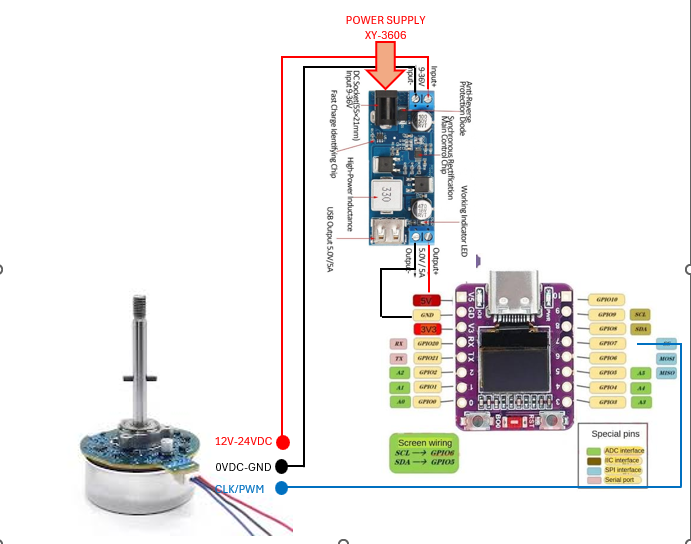

Complete guide to building a HomeKit-enabled BLDC fan controller using an ESP32-C3, a 0.42" OLED display for speed readout, and a step-down power module.

---

### **1. Hardware Setup & Wiring**

**Required Components:**

* **ESP32-C3** Development Board
* **BLDC Motor** (with built-in driver/ESC accepting PWM/CLK input)
* **XY-3606 Buck Converter** (9–36V Input, 5V/5A Output)
* **0.42" OLED Display** (I2C SSD1306, 72x40)
* **DC Power Supply** (12V–24V DC)



### **2. Arduino IDE Environment Setup**

#### **Required Libraries**

Open **Library Manager** (`Ctrl + Shift + I`) in Arduino IDE and install:

1. **HomeSpan** (by HomeSpan)
2. **Adafruit SSD1306**
3. **Adafruit GFX Library**

#### **Partition Scheme Configuration (CRITICAL)**

HomeSpan includes Apple's full HomeKit cryptography stack, making the compiled firmware large. Leaving the default partition scheme will result in a `Sketch too big` error.

1. Go to **Tools** in Arduino IDE.
2. Select **Board** $\rightarrow$ **ESP32C3 Dev Module** (or your specific ESP32-C3 board).
3. Hover over **Partition Scheme**.
4. Select: **Huge APP (3MB No OTA/1MB SPIFFS)** *(or Minimal SPIFFS (Large APPS with OTA))*.

---

```

---

### **3. Network Configuration & Apple HomeKit Pairing**

#### **Step 1: Wi-Fi Provisioning via Serial Monitor**

1. Open the **Serial Monitor** in Arduino IDE, set Baud Rate to **`115200`** and selection to **`Both NL & CR`**.
2. Type **`W`** and press Enter. HomeSpan will scan for nearby Wi-Fi networks.
3. Enter the index number corresponding to your local Wi-Fi SSID.
4. Enter your Wi-Fi password. The ESP32-C3 will save credentials and connect automatically.

#### **Step 2: Pairing with Apple Home App**

1. Ensure your iPhone/iPad is on the **same Wi-Fi network** as the ESP32-C3.
2. Open the **Apple Home** app $\rightarrow$ Tap **`+`** $\rightarrow$ Tap **Add Accessory**.
3. Select **More options... / Don't Have a Code or Cannot Scan?**
4. Select **HomeSpan Fan** from the discovered accessories list.
5. Enter the default HomeSpan setup code:

$$\mathbf{466 - 37 - 726}$$

6. Tap **Add Anyway** if prompted about an uncertified accessory. Assign the device to your desired room.

---

### **4. Essential HomeSpan Command Line Interface (CLI)**

You can control HomeSpan configuration at any time by typing these characters into the Serial Monitor (`115200` Baud):

* `W` - Reconfigure Wi-Fi settings.
* `S` - Display network status, IP address, and Wi-Fi signal strength.
* `F` - **Factory Reset** (clears saved Wi-Fi and HomeKit pairings to start fresh).